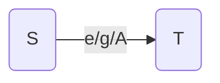

  >  最近看了 《UML 建模分析与设计》 这本大学课程关于uml的介绍和解释，学到了很多，这里记录下来，加深记忆。

## UML 作用
&nbsp;&nbsp;uml是一种建模语言，提供了多种可视化的描述模型元素，可以直观、准确的反映模型所代表的问题和内容，为软件开发阶段提供了模型化和可视化建模支持。包含需求分析、规约、构造、和配置。现在已经被工业界以及学术界广泛接受的标准建模语言。uml 有自己的官方网站，OMG ，到现在已经有几个版本了。目前主要的是uml 2.0 .

&nbsp;&nbsp; 在软件开发中，编码行为不是最重要的工作，前面的设计、文档才是更加体现一个人的基本功力，展现你的厉害之处。在我看来，编码是一个翻译行为，把产品经理整理的需求翻译为code，让计算机执行。有些码农经常会抱怨产品需求不清晰，老是不全面，编码进行不下去；注意，需求不清晰的问题关键就是uml的建模工作没有做好，导致下面进行不下去；所以说，文档重要，非常重要；有时候比代码更加重要；一个工程交付件不仅有代码，还要有各种其他的文档说明和配置；往往这些文档是更加重要，因为它比代码更具有交流意义；便捷。这也是我为什么要学习uml 这本课程的原因，尤其是对非科班出身的，希望读者们也能自学。最好对着大学教材，这是最好的学习方法；

### uml 简介
uml 是一种对软件进行描述、规约、建模的语言，有如下特点：
 - 可视化
 - 规约
 - 构造
 - 文档化
其运用领域非常广阔，机械系统、企业机构、业务流程等。

#### 基本构造
事物、关系和模型图 是组成uml 的构造块

#### uml 事物
事物是指模型中用到的基本元素，有结构事物、行为事物、分组事物和注释事物。然后在结合关系，就构成了模型。 
比如说：结构事物通常是模型的静态组成部分，有类、接口、用例等等；行为事物包含交付、状态机、活动；注释事物就是注释文档。
#### 关系
uml 关系可以分为四种：

 - 依赖 ：类之间的使用关系；常常是主谓关系，就是一个bean 执行了某个动作aciton，形成了一个主谓关系，这种情况就是很常见，比如人吃饭，人是一个类，饭是一个类，那人和饭之间的关系就是一个依赖关系；符号为：----- + 箭头 
- 关联 ：对象之间的结构关系；比如聚合、组合，描述整体和部分的关系；常常用于实体类之间的描述；书和图书馆就是聚合关系或者组合关系，很多书组成了图书馆；还有播放窗口和播放界面，一个播放界面window可能有一个或多个窗口cell组成；其符合为：（实体线）—— + 实心菱形；
- 泛化（继承extend）：按照java的类的概念就好理解了，其符号为 —— + 向右的三角形 ▲
- 实现（implement）:  按照java 类的概念理解，其符号为 ---- + 向右的三角形 ▲

#### 模型图
模型图就是我们重点要说的部分，模型图分为结构图和行为图: 

对于结构图，常用的图有类图、包图、构件图 ；行为图有：活动图、状态图、顺序图、用例图四种。

## 用例图
use case diagram 用例图 描述系统为用户提供的功能，但不涉及功能的具体实现细节。用于描述系统的需求，可以针对特定的维度去划分用例；

### 组成部分
一个系统的用例图 system ，有参与者 actor ，其描述的功能use case和用户搭配起来就是一个用例 ；我们可以通过角色去划分参与者，确定功能，在组合为用例；

### 示意图

student 为参与者 actor ，相应的功能有 login 、query course/personal info 等等。在这个学生网络选课系统中，以学生为视角，有这样一个系统组成。同样的，还可以管理员的角色中出发来去看待：

#### 如何构建用例图
软件开发中，采用“用例驱动、以架构为中心，迭代增量开发” 开发模式，我们一般按照下面的步骤来：

 1. 划分系统的逻辑边界
 2. 确定系统的主要参与者、次要参与者
 3. 确定主要的用例
 4. 确定参与者和用例的关系

通常，用例图中一个功能可能会涉及到多个参与者，所以上面的例子仅仅供参考，会有更复杂的用例。同时，参与者之间、功能之间还可能存在继承、包含等关系；所以这些可能会用到。

## 类图
类图就是描述系统中各个类之间的关系，也属于结构图。但是做过开发就知道类的设计及关系非常之重要，它隐含了软件的架构设计、开发思想、实现思路。常常在开发时遇到某一个重大的功能，都需要设计文档，而类的设计文档又是非常重要的一个，直接体现你的架构水平和认知水平。

### 组成元素

图中 为student 类的全面元素：包含 类名、属性、操作；

- 类名 ： 通常名词单数形式，第一个字母大写；在矩形框第一个框内，必须要有
- 属性：矩形框内第二个元素，如userName、password 等等，表示一个类的属性，可以更加不同的类去抽象出来的相关特征；在描述属性时，还有其类型，是基本类型 int 、float 等，还是其他对象类型；另外还有可见性 - 表示私有自己可见。
-  操作：对象的一组行为操作，即方法或函数，比如 login 、query ；放在第三栏，其行为操作也有可见性和返回值；

#### 可见性符号
|  符号|名称  | 含义
|--|--|--|
| + | public  | 所有可见 |
| -| private| 仅自己可见|
| # | protect| 自己和之类可见 |
| ~| package|  包可见|

#### 类关系
类的关系就是前面讲到的关系，完全适用

示意图 ： 以学生选课系统为例

##  包图
包图就是描述系统中各个包之间的关系。当我们的软件越来越复杂，功能越来越复杂，我们需要合理的设计包结构，使得便于交流和扩展。一般的，我们把逻辑相同的类放在同一个包，具有高内聚、低耦合的特点。和类图非常相似，只不过二者在描述层次上不一样罢了，一个描述类，一个在高抽象层次上描述包；类图是针对某一个点进行描述，包图针对一个模块、系统进行描述；视角不一样，仅此而已。

示意图

和类图区别：

包元素之间的关系只有两种：继承和依赖
- 依赖：分为导入、访问两种；导入就是 java中 import A 类 到B 类中，B 类可以适用A 类； 访问忽略。符号 ----- + 箭头
- 继承 ： 与java 语法一样。符号 —— + ▲ （空心）

## 活动图
活动图聚焦系统的业务流程、操作过程。使用顺序、选择、循环等控制结构来描述。其优点像我们之前课本上学习的流程图；其实也可以说是流程图

### 活动
活动图允许以活动的形式来指定用户定义的行为。活动是一个有向图，节点代表活动的组成。

#### 动作
用圆角矩形表示，常常指对象的一个行为操作，一系列的动作组成活动

#### 节点
控制节点： 初始节点、终止节点；分叉、汇合节点；

#### 泳道
将一个活动图中的活动节点进行分组，每一组表示负责复杂那些活动的业务实体 ；这样可以增加一种角度去解读

#### 元素

示例图

## 顺序图
顺序图是交互动态的行为图，描述了对象之间的消息、数据随时间变化的交互；主要元素有：对象、参与者、消息。

#### 参与者
用带有生命线的对象表示，生命线使用垂直的虚线表示，顶端表示生命线的起始，并在顶端的矩形框写出参与者角色；

#### 消息
消息用箭头表示，同步消息用实心箭头表示；异步消息用虚线枝状箭头表示；还可以对消息进行编号；1.1 、1.2、1.3 、1.1.1 等等。

#### 组合
顺序图中，我们可以使用各种组合片段进行表达，常用的有

- 分支和循环 ：alt 替代； opt 选择； loop 循环； break 异常
- 并发和顺序： seq /strict 顺序 ； par 并发； critical 原子交互；

示意图：

## 状态机
描述对象在它的生命周期中响应事件说经历的状态序列以及它对那些事件的响应。

### 基本概念
- 状态图：状态、迁移、事件、活动和动作组成的图；
- 状态 state：对象在生命周期内，满足某些条件和动作的状态；
- 迁移 transition：状态之间的一种关系；
- 事件： 事件引起状态的变迁，促使状态机迁移到另一种状态；
- 活动：由一系列的动作组成；

### 状态
通常用动词的现在进行时表示 如 waiting、acting、eating 等等，状态包括状态名+ 内部活动；

还有子状态机，即把某些重复的行为通过一个图单独表述，就是子状态机的作用。

### 迁移

- S : 源状态 source state：
- e：event trigger 触发条件
- g ： guard condition：监护条件
- A action ： 动作 
- T target state目标状态

### 建模元素

### 示例

